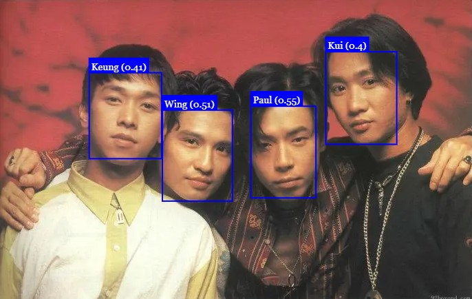

# Easy Facial Reognition



Using [Face-api.js](https://github.com/justadudewhohacks/face-api.js), This program learns the faces of the band members of Beyond from the images in the labeled_images folder, then tries to recognize faces from images in the test_images folder or user-uploaded images.

Image folders:
- **label_images:** Images used to train the models
- **test_images:** Images used to test the face recognition

### Installation
``` bash
npm install
```

### To run the app
Execute this in the terminal:
``` bash
npm start
```
Navigate to http://localhost:5555 in your browser.

Press `Ctrl+C` to stop the execution.

### Beyond
Beyond was a Hong Kong rock band formed in 1983. The band became prominent in Hong Kong, Taiwan, Japan, Singapore, Malaysia, Mainland China, and Overseas Chinese communities. The band is widely considered as the most successful and influential Cantopop band from Hong Kong.<br>
More on [Wikipedia](https://en.wikipedia.org/wiki/Beyond_(band))

### Credits
Built according to the [Easy Face Recognition Tutorial With JavaScript](https://www.youtube.com/watch?v=AZ4PdALMqx0) by [Web Dev Simplified
](https://www.youtube.com/@WebDevSimplified)

The models and the face-api-min.js are from the [Face API Github](https://github.com/justadudewhohacks/face-api.js)

*Photos are downloaded from the internet.*